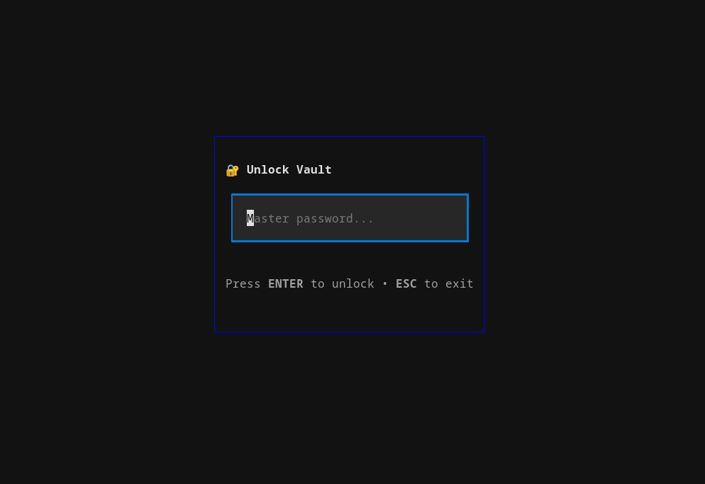
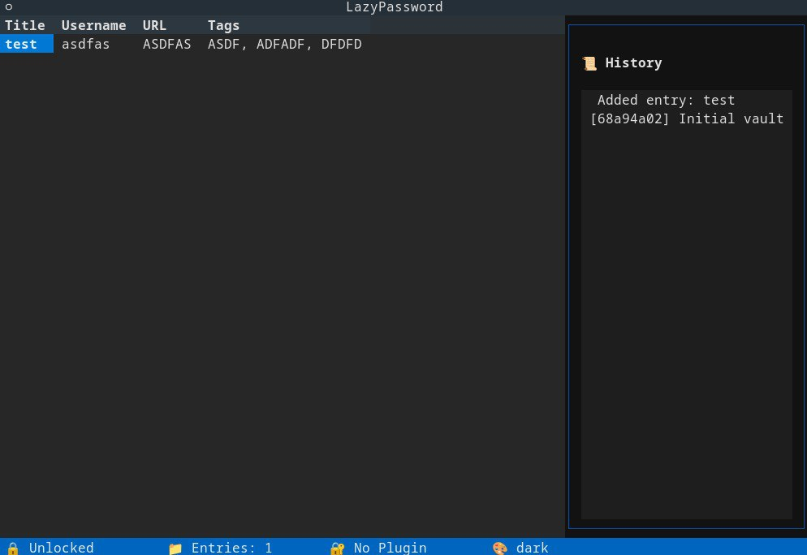

<div align="center">

# 🔐 lazypassword

[](https://golang.org/)
[](LICENSE)
[](https://goreportcard.com/)
[]()

**A terminal password manager for lazy people. Fast, keyboard-driven, and completely offline.**

</div>

---

<div align="center">
  
</div>

## ✨ Features

- 🔒 **Military-grade Encryption** — AES-256-GCM + Argon2id key derivation
- ⚡ **Lightning Fast** — Single static binary, instant startup
- ⌨️ **Vim Keybindings** — `j/k` to navigate, `/` to search, `enter` to copy
- 📜 **Git Versioning** — Track every change with built-in git history
- 📋 **Secure Clipboard** — Auto-clear after 30 seconds
- 🔑 **Password Generator** — Cryptographically secure random passwords
- 📵 **100% Offline** — No cloud, no accounts, no tracking
- 🚀 **Zero Dependencies** — Single binary works everywhere

## 📸 Screenshots

<div align="center">
  
  <br><br>
  <p><i>Main interface with entries and git history panel</i></p>
</div>

## 🚀 Quick Start

### Installation

**Download Pre-built Binary** (Coming Soon)

```bash
# Or install from source
git clone https://github.com/Wuedmo/lazypassword.git
cd lazypassword
go build -o lazypassword
```

### First Run

```bash
# Launch with default vault location (~/.config/lazypassword/vault.lpv)
./lazypassword

# Or specify custom vault location
./lazypassword --vault /path/to/your/vault.lpv
```

On first launch, you'll create a master password (minimum 12 characters). Your vault is automatically created and encrypted.

## ⌨️ Usage

### Key Bindings

| Key | Action | Description |
|-----|--------|-------------|
| `↑` / `k` | Navigate Up | Move to previous entry |
| `↓` / `j` | Navigate Down | Move to next entry |
| `Enter` | Copy Password | Copy selected password to clipboard |
| `a` | Add Entry | Create new password entry |
| `e` | Edit Entry | Modify selected entry |
| `d` | Delete Entry | Remove selected entry |
| `/` | Search | Filter entries by name |
| `g` | Git History | View vault change history |
| `v` | Toggle Panel | Show/hide history panel |
| `l` / `q` | Lock/Quit | Lock vault and exit |

### Basic Workflow

1. **Unlock** your vault with your master password
2. **Navigate** with `j/k` or arrow keys
3. **Search** with `/` and start typing
4. **Copy** passwords with `Enter`
5. **Add** new entries with `a`
6. **Lock** with `l` when done

## 📦 Building from Source

### Prerequisites
- Go 1.21 or higher
- Git

```bash
# Clone repository
git clone https://github.com/Wuedmo/lazypassword.git
cd lazypassword

# Download dependencies
go mod tidy

# Build for your platform
go build -o lazypassword

# Or use Make
make build

# Install system-wide (optional)
make install
```

### Cross-Platform Builds

```bash
# Linux
GOOS=linux GOARCH=amd64 go build -o lazypassword-linux

# macOS
GOOS=darwin GOARCH=amd64 go build -o lazypassword-mac

# Windows
GOOS=windows GOARCH=amd64 go build -o lazypassword.exe
```

## 🔒 Security

- **Encryption**: AES-256-GCM with Argon2id key derivation
- **Memory**: Securely wiped on lock/exit
- **Files**: Atomic writes with 0600 permissions
- **Clipboard**: Auto-clears after 30 seconds
- **Offline**: No network access required

## 🧪 Testing

```bash
# Run all tests
go test ./...

# Run with coverage
go test -v ./...

# Run benchmarks
go test -bench=. ./...
```

## 🗺️ Roadmap

### ✅ Completed
- [x] Core encryption (AES-256-GCM, Argon2id)
- [x] Terminal UI with bubbletea
- [x] Git versioning for history
- [x] Secure clipboard management
- [x] Password generator
- [x] Vim keybindings
- [x] Unit & integration tests

### 🚧 In Progress
- [ ] CI/CD pipeline
- [ ] Pre-built release binaries
- [ ] Import/Export functionality

### 🔮 Future
- [ ] Fuzzy search
- [ ] Plugin system
- [ ] TOTP/2FA support
- [ ] SSH key management
- [ ] API key storage

## 🤝 Contributing

Contributions are welcome! Here's how to get started:

1. **Fork** the repository
2. **Create** a feature branch (`git checkout -b feature/amazing`)
3. **Commit** changes (`git commit -m 'Add amazing feature'`)
4. **Push** to branch (`git push origin feature/amazing`)
5. **Open** a Pull Request

Please ensure:
- Tests pass (`go test ./...`)
- Code is formatted (`gofmt -w .`)
- Commit messages are clear

## 📝 License

[MIT License](LICENSE) © 2024

## 🙏 Acknowledgments

- Inspired by [LazyGit](https://github.com/jesseduffield/lazygit) by Jesse Duffield
- Built with [bubbletea](https://github.com/charmbracelet/bubbletea)
- Encryption powered by [golang.org/x/crypto](https://golang.org/x/crypto)

---

<div align="center">

**Made with ⚡ for lazy password managers everywhere**

[⭐ Star this repo](https://github.com/Wuedmo/lazypassword) | [🐛 Report Bug](../../issues) | [💡 Request Feature](../../issues)

</div>